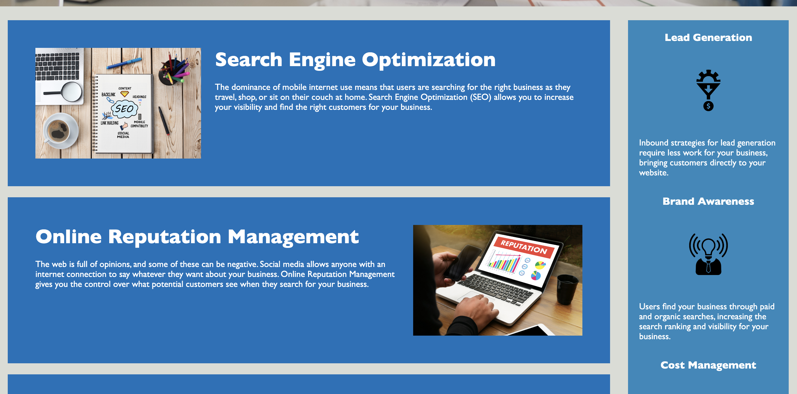

# Module1-Challenge

This project was used to demonstrate my ability to modify code in HTML and CSS to include: 

- Semantic HTML elements that follow a logical structure independent of styling and positioning
- Accessible alt attributes for icon and image elements
- Heading attributes that fall in sequential order
- A concise and descriptive title element
- CSS selectors and properties that are consolidated and organized to follow semantic structure
- CSS file that is properly commented

# Usage

This project has functional links in the navigation bar that relocate the user to the corresponding article element,

    
